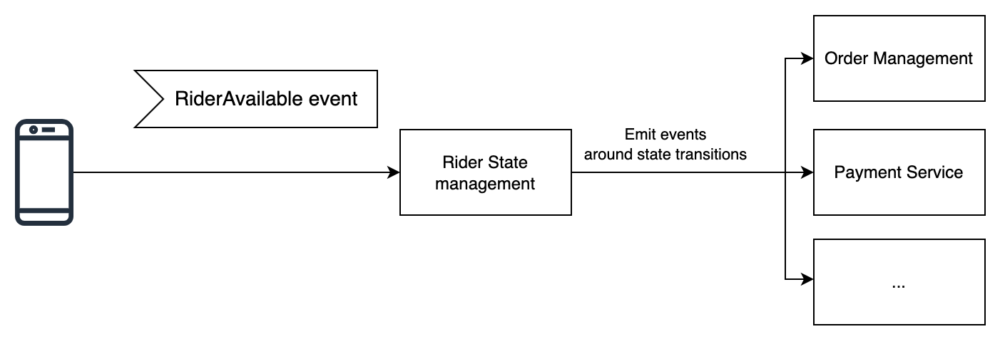
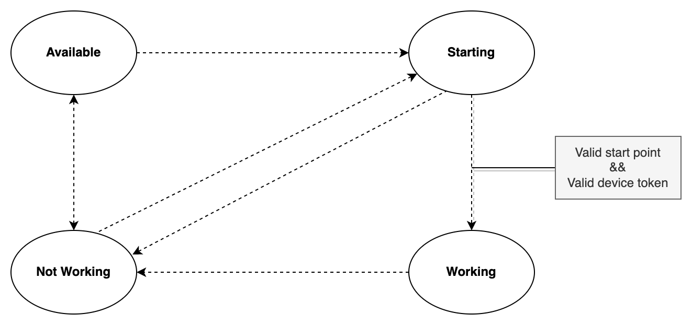

# Rider State Management Demo

This repository contains different examples how you can manage state with the AWS serverless services, especially how you could use [Step Functions](https://aws.amazon.com/step-functions/) to do state management and how to do this with the [AWS Cloud Development Kit (CDK)](https://aws.amazon.com/de/cdk/).

## Table of content
- [Overview](#overview)
- [Step Functions Implementations](#step-functions-implementations)
  * [ASL integration](#asl-integration)
  * [CDK Implementation](#cdk-implementation)
- [Usage](#usage)
  * [Bootstrap your environment](#bootstrap-your-environment)
  * [Install dependencies](#install-dependencies)
  * [Initial deployment](#initial-deployment)
  * [Pre-populate Rider State](#pre-populate-rider-state)
  * [Execute rider state change request](#execute-rider-state-change-request)
  * [Destroy the stacks](#destroy-the-stacks)
- [License](#license)

## Overview

Imagine you want to manage a fleet of unicorns for your [Wild Rydes](http://www.wildrydes.com/) business. You want to track the current state of riders and manage the state transitions to only allow valid state transitions. Also you want to let your subscribers know of state changes, so that you can e.g. pay riders accordingly.



These rider state changes can be represented by the following state machine.



The example application demonstrates a basic state management scenario, which consists of several steps:
1. A rider submits a state change request (e.g. I'm available)
2. The workflow validates the input
3. The workflow fetch the current rider state data from DynamoDB
4. The workflow validates if the transition is possible
5. The workflow transition the rider to the next state and persist it
6. The workflow emits rider state change information to subscribers

If there is a persistent error, you can send the event to a Dead Letter Queue (DLQ), for further investigation.


## Step Functions Implementations
### ASL integration

[This version](cdk/state-management-demo-asl-stack.ts) uses the exported [Amazon State Language (ASL)](https://docs.aws.amazon.com/step-functions/latest/dg/concepts-amazon-states-language.html) from the [AWS Step Functions Workflow Studio](https://docs.aws.amazon.com/step-functions/latest/dg/workflow-studio.html). This is directly importet into the CDK:
```typescript
const riderStateTransitionManagementStateMachine = new sfn.StateMachine(this, "RiderStateTransitionManagement-ASL-CDK", {
        definition: new sfn.Pass(this, "StartState"),
        // ...
    }
);

const cfnStatemachine = riderStateTransitionManagementStateMachine.node.defaultChild as sfn.CfnStateMachine;

const stateMachineDefinition = JSON.parse(fs.readFileSync("rider-state-management.asl.json", "utf8"));
cfnStatemachine.definitionString = JSON.stringify(stateMachineDefinition);
```

### CDK Implementation
[This version](cdk/state-management-demo-stack.ts) uses the Step Function CDK modules. This is directly implemented in CDK:
```typescript
// Set up the necessary resources [...]

const riderStateTransitionManagementStateMachineDefinition = new Choice(this, "Is rider id and next state valid?")
    .when(
    // Check if input is valid
    Condition.and(
        ...allArePresent("$.input.rider_id", "$.input.next_state"),
        anyStringMatches("$.input.next_state", "Not Working", "Available", "Starting", "Working")
    ),
    // Get current rider state information
    getCurrentRiderStateInformation.next(
        new Choice(this, "Is next state a valid transition?")
        .when(
            // If it transitions from starting to working...
            isValidStateTransition({
                currentStateVariable: "$.rider.state",
                nextStateVariable: "$.input.next_state",
                validTransitions: [["Starting", "Working"]],
            }),
            // Validate the start point and transition the rider to the next state
            validateStartPoint.next(transitionRiderToNextStateAndPersistIt)
        )
        .when(
            // If is another valid transition...
            isValidStateTransition({
                currentStateVariable: "$.rider.state",
                nextStateVariable: "$.input.next_state",
                validTransitions: [
                    ["Not Working", "Available"],
                    ["Not Working", "Starting"],
                    ["Available", "Not Working"],
                    ["Available", "Starting"],
                    ["Starting", "Not Working"],
                    ["Working", "Not Working"],
                ],
            }),
            // Transition the rider to the next state and emit change event
            transitionRiderToNextStateAndPersistIt.next(emitRiderStateChangeEvent)
        )
        // Otherwise send event to DLQ
        .otherwise(sendEventToDlqForManualHandling)
    )
    )
    // Otherwise send event to DLQ
    .otherwise(sendEventToDlqForManualHandling);
```


## Usage
### Bootstrap your environment
```bash
cdk bootstrap aws://ACCOUNT-NUMBER/REGION       # e.g. cdk bootstrap aws://123456789012/us-east-1
```

For more details, see [AWS CDK Bootstrapping](https://docs.aws.amazon.com/cdk/latest/guide/bootstrapping.html).

### Install dependencies
```bash
npm install
```

### Initial deployment
```bash
cdk deploy StateManagementDemoStack
```

To deploy the ASL stack, you first have to change the region and the account id in your asl.json, e.g. `https://sqs.us-east-1.amazonaws.com/123456789012/RiderStateDLQ-ASL-CDK`.

Afterwards you can deploy it:

```bash
cdk deploy StateManagementASLDemoStack
```

### Pre-populate rider state
```bash
aws dynamodb put-item \
    --table-name=RiderStateTable-CDK \
    --item='{ "Area#Entity": { "S": "Munich#RIDER#1" }, "Lat": { "N": "48.13743" }, "Long": { "N": "11.57549" }, "State": { "S": "Not Working" }, "Timestamp": { "N": "-1" } }'

aws dynamodb put-item \
    --table-name=RiderStateTable-ASL-CDK \
    --item='{ "Area#Entity": { "S": "Munich#RIDER#1" }, "Lat": { "N": "48.13743" }, "Long": { "N": "11.57549" }, "State": { "S": "Not Working" }, "Timestamp": { "N": "-1" } }'
```

### Execute rider state change request

In order to start the state machine, go to the Step Functions console, select your Step Function and start a execution with this parameters:

```json
{
    "input": {
        "rider_id": "Munich#RIDER#1",
        "next_state": "Available"
    }
}
```

This will result in:
```
{
  "input": {
    "rider_id": "Munich#RIDER#1",
    "next_state": "Available"
  },
  "rider": {
    "state": "Not Working",
    "rider_id": "Munich#RIDER#1",
    "lat": "48.13743",
    "long": "11.57549",
    "timestamp": "-1"
  },
  "ddb": {
    "status_code": 200
  },
  "sns": {
    "status_code": 200
  }
}
```


### Destroy the stacks
```bash
cdk destroy --all
```

## License

This project is licensed under the Apache-2.0 License.
